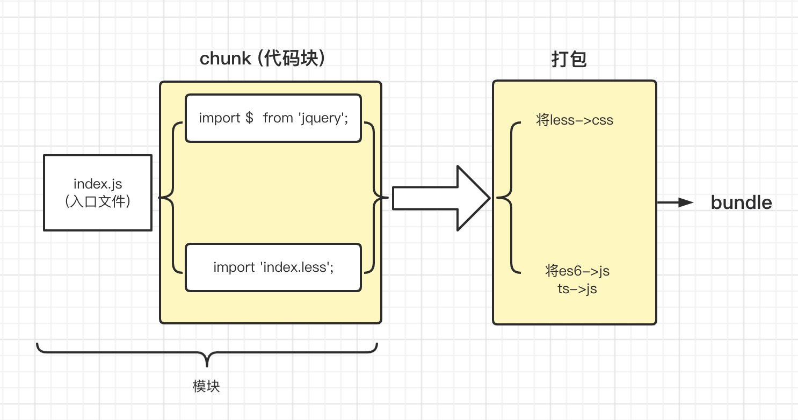

<!--
 * @Description: 
 * @Author: liyongshuai
 * @Date: 2022-05-02 16:10:40
 * @LastEditTime: 2022-05-02 17:24:20
 * @LastEditors: liyongshuai
-->

### webpack打包机制
- 需要有个入口文件，例如是 index.js 文件 index.js 文件中 有对比如说是jquery / less 文件 进行打包
- 引进来的文件 成为chunk（代码块）

### webpack五个核心概念
- entry: 指定入口文件
- output: 指定输出文件
- loader: 做语法转换 如ts->js less->css 图片转换
- plugins: 做一些额外的处理，如压缩
- mode: 区分环境 `development` 、`production`